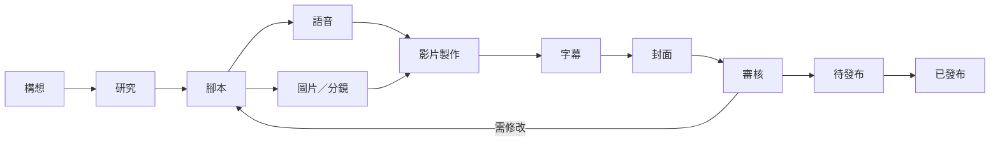

# 產品總覽

YTPM 是影片製作中樞，不是剪輯器。它讓一支影片從構想到發布的所有可交付物有固定位置、狀態、版本與驗證規則。

## Job to be Done

「當我同時製作多支 YouTube 影片時，我要快速知道每支影片做到哪裡、缺什麼、最新檔案在哪裡，並讓人工或 AI Agent 可以安全接手。」

## 核心物件

- Library：影片專案根目錄。
- Project：一支影片。
- Asset：腳本、音訊、圖片、影片、字幕、封面等檔案。
- Task：可執行工作。
- Deliverable：發布前必須完成的成果。
- Workflow Template：影片類型的階段與必要成果。
- Event：可追蹤的操作紀錄。

## 預設 Workflow

