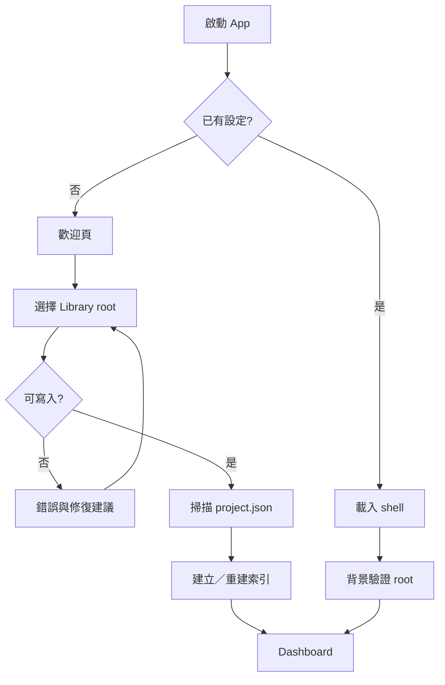
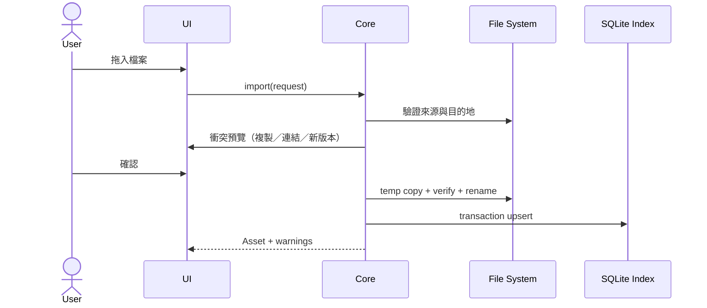

# 完整使用流程設計

## Flow A：首次啟動

首次啟動不可強迫登入，也不可要求雲端權限。

## Flow B：建立影片

1. Dashboard 點「新增影片」。
2. Step 1：標題、頻道、系列。
3. Step 2：比例、語言、目標長度、模板。
4. Step 3：發布日期、標籤、Library。
5. Preview：實際資料夾名稱與將建立的內容。
6. 建立中顯示每一步。
7. 成功後進入 Overview；失敗可重試或開啟錯誤詳情。

## Flow C：每日接續工作

1. Dashboard 顯示「下一步」與逾期／缺漏。
2. 開啟專案。
3. Overview 顯示目前階段、下一個建議任務、最新素材。
4. 完成任務後自動更新進度。
5. 外部工具存檔時，watcher 更新 asset。

## Flow D：素材匯入

## Flow E：發布前審核

- 系統規則檢查。
- 使用者人工 checklist。
- 產生 review export。
- 不通過的項目可建立修正任務。
- 所有強制項目完成才允許標「待發布」，但可填寫 override 理由。

## Flow F：搬移／備份

- 關閉該專案 watcher。
- 執行一致性 snapshot。
- 使用一般檔案複製工具搬移。
- 新 Library 掃描後重新索引。
- path-based 欄位改為 relative path；舊 absolute path 只保留 event。

## Flow G：錯誤恢復

- App 偵測 `.tmp` 或 operation journal。
- 顯示：恢復、保留供檢查、清除（清除需確認）。
- 自動儲存 draft 與正式版本分離。
