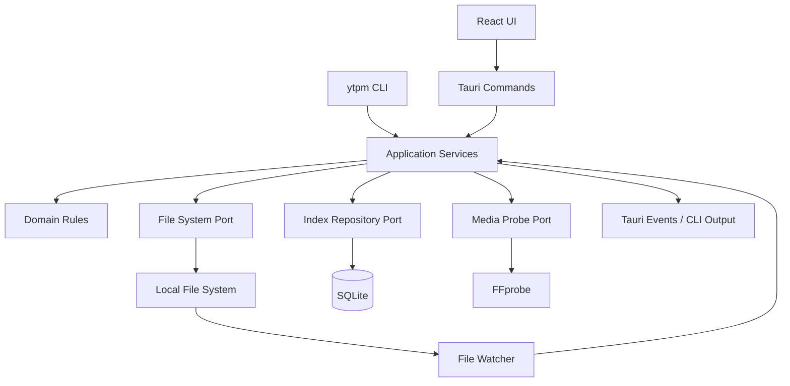

# System Architecture

## Component Diagram

## Threading

- UI thread：render 與輕量狀態。
- Tokio runtime：I/O、DB、scan、hash。
- CPU pool：縮圖、waveform、hash 大檔。
- External process：FFmpeg／Whisper，帶 cancel token 與 stdout parser。

## Cache

- SQLite index：projects、assets、tasks、events。
- thumbnail cache 位於 App cache，不放進影片專案，除非使用者匯出。
- cache 可刪除，不能是唯一資料。

## IPC

Tauri command 命名：`project_create`、`project_list`、`project_validate`。長任務回傳 `job_id`，進度透過 event `job://progress`。

## Permission

使用 Tauri capabilities 最小化。MVP 只允許核心 commands，不給 frontend 任意 shell 或全檔案系統權限。
